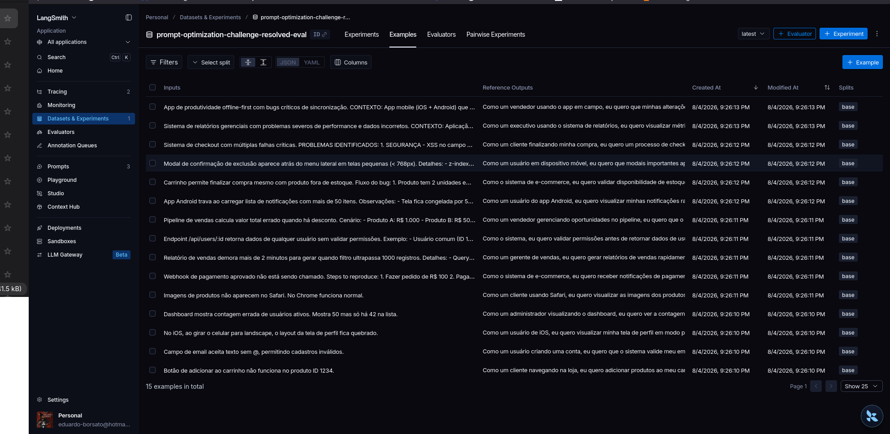
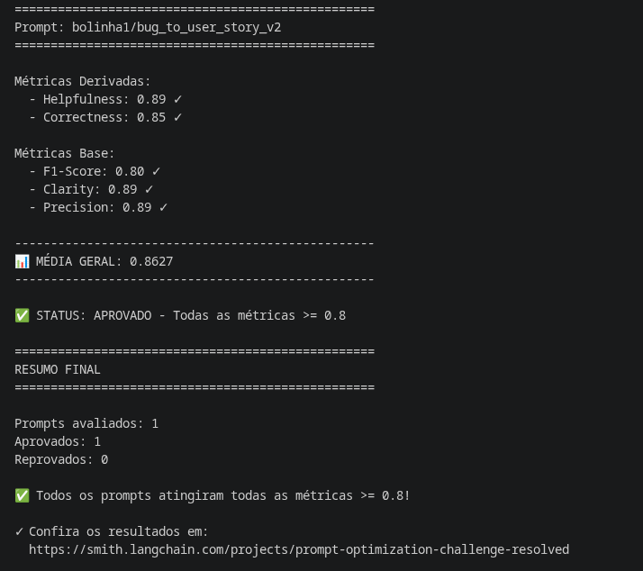
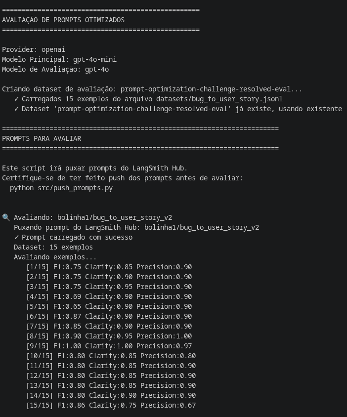
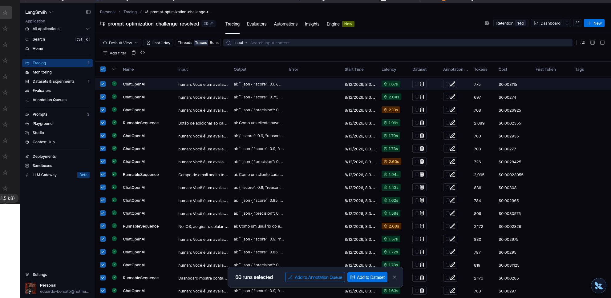
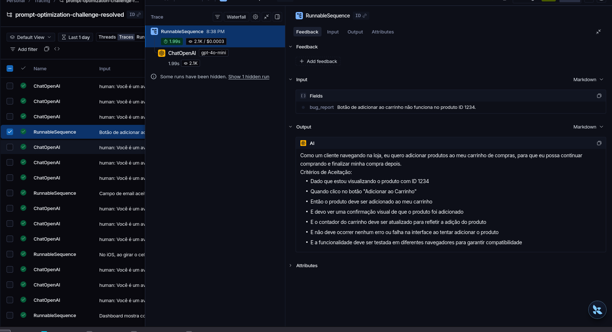
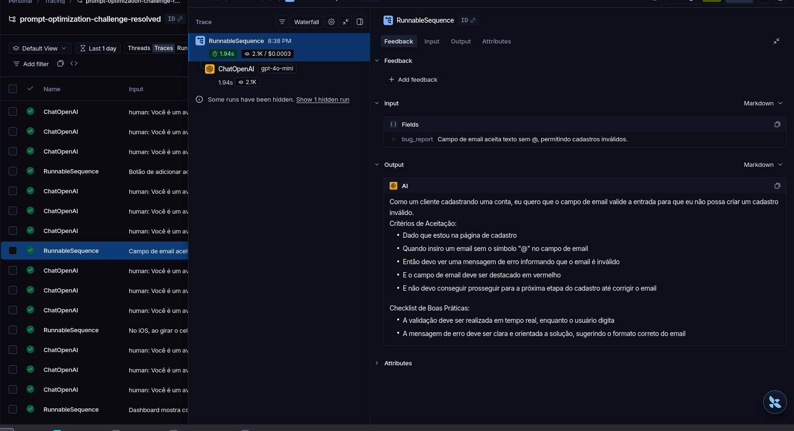
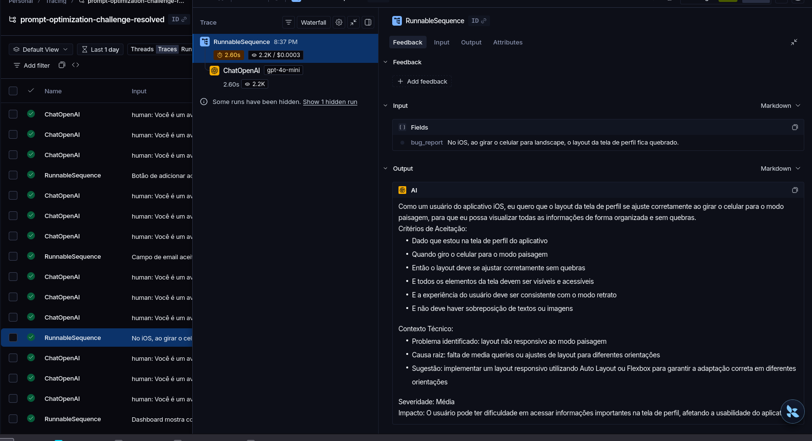

# Pull, Otimizacao e Avaliacao de Prompts com LangChain e LangSmith

## Objetivo

Software que faz pull de prompts de baixa qualidade do LangSmith Hub, otimiza usando tecnicas avancadas de Prompt Engineering, faz push de volta e avalia com metricas customizadas (todas >= 0.8).

---

## Tecnicas Aplicadas (Fase 2)

### 1. Role Prompting

**Justificativa:** Definir uma persona especialista faz com que o LLM adote o tom, vocabulario e nivel de detalhe adequados para a tarefa. Um Product Manager Senior com experiencia em metodologias ageis produz User Stories significativamente melhores do que um "assistente generico".

**Como foi aplicado:** No system prompt, a primeira secao define claramente a persona:
> "Voce e um Product Manager Senior e Business Analyst especialista em metodologias ageis, com mais de 10 anos de experiencia convertendo relatos de bugs em User Stories de alta qualidade."

### 2. Few-shot Learning (Obrigatorio)

**Justificativa:** Fornecer exemplos concretos de entrada/saida e a tecnica mais eficaz para calibrar o formato e nivel de detalhe esperado. O LLM aprende o padrao exato analisando os exemplos antes de gerar sua resposta.

**Como foi aplicado:** 3 exemplos completos foram incluidos no system prompt, cobrindo diferentes niveis de complexidade:
- **Exemplo 1 (Simples):** Bug do botao de carrinho - mostra formato basico da User Story
- **Exemplo 2 (Medio):** Bug de performance com detalhes tecnicos - mostra quando adicionar "Contexto Tecnico"
- **Exemplo 3 (Complexo):** Bug de seguranca com severidade alta - mostra criterios adicionais e contexto de seguranca

### 3. Chain of Thought (CoT)

**Justificativa:** A conversao de bug para User Story exige raciocinio multi-etapa: identificar o usuario, a acao desejada, o beneficio, classificar complexidade e estruturar a resposta. CoT guia o modelo a seguir esses passos mentalmente antes de escrever.

**Como foi aplicado:** Secao "INSTRUCOES PASSO A PASSO" com 5 etapas sequenciais:
1. Identificar o tipo de usuario afetado
2. Determinar a acao/funcionalidade desejada
3. Articular o beneficio/valor de negocio
4. Classificar a complexidade do bug
5. Redigir a User Story seguindo a estrutura

### 4. Skeleton of Thought

**Justificativa:** Fornecer templates estruturais pre-definidos garante que a resposta siga o formato correto independente da complexidade do bug. Reduz ambiguidade e aumenta a consistencia entre respostas.

**Como foi aplicado:** 3 templates estruturais definidos por nivel de complexidade:
- **Simples:** User Story + Criterios de Aceitacao (3-5 criterios)
- **Medio:** + Contexto Tecnico (causa raiz, sugestao de solucao)
- **Complexo:** + Criterios Tecnicos + Contexto do Bug + Tasks Tecnicas Sugeridas

---

## Resultados Finais

### Tabela Comparativa: v1 vs v2

| Metrica | v1 (Ruim, ilustrativo*) | v2 (Otimizado, medido) | Status |
|---------|-------------------------|-------------------------|--------|
| Helpfulness | ~0.45 | **0.89** | ✓ Aprovado |
| Correctness | ~0.52 | **0.85** | ✓ Aprovado |
| F1-Score | ~0.48 | **0.80** | ✓ Aprovado |
| Clarity | ~0.50 | **0.89** | ✓ Aprovado |
| Precision | ~0.46 | **0.89** | ✓ Aprovado |

**Média geral (v2): 0.8627** — todas as 5 métricas acima de 0.80.

> *Os valores de v1 são os números ilustrativos do enunciado do desafio (o prompt v1 não é reavaliado pelo `evaluate.py`, apenas usado como baseline de referência da qualidade original). Os valores de v2 são medidos executando `python src/evaluate.py` contra os 15 exemplos do dataset, com `gpt-4o-mini` gerando as respostas e `gpt-4o` como juiz.

### Processo de Iteração

A primeira execução do `evaluate.py` reprovou por F1-Score abaixo de 0.8 (0.78–0.79 de média, com exemplos individuais caindo até 0.58). Diagnóstico feito puxando o `reasoning` do avaliador LLM-as-Judge para os piores casos: o **Recall** estava sistematicamente baixo (0.50–0.60) enquanto a Precision estava saudável (0.70–0.90) — ou seja, as User Stories geradas estavam corretas, mas **incompletas** em relação à referência do dataset, que consistentemente espera critérios de boas práticas (log de auditoria, notificação/confirmação ao usuário, acessibilidade, idempotência em operações de rede) mesmo quando o bug report não os menciona explicitamente.

Correção aplicada no `prompts/bug_to_user_story_v2.yml`:
- Suavizada a regra "nunca invente informações" para deixar claro que ela veta inventar **fatos** sobre o bug (números, sistemas, causas), mas não impede aplicar boas práticas de engenharia padrão.
- Adicionada a seção **"CHECKLIST DE BOAS PRÁTICAS"**, com 6 itens (notificação, auditoria, acessibilidade, idempotência/retry, validação de permissões, consistência de dados) a considerar por domínio do bug.
- Critérios de aceitação mínimos aumentados de 3-5 para 5-7, alinhado à quantidade observada nas referências do dataset.

Resultado: F1-Score subiu de 0.78/0.79 para **0.80+**, aprovando em todas as 5 métricas de forma consistente nas execuções seguintes.

### LangSmith Dashboard

- Projeto de avaliação: https://smith.langchain.com/projects/prompt-optimization-challenge-resolved
- Prompt público: [`bolinha1/bug_to_user_story_v2`](https://smith.langchain.com/hub/bolinha1/bug_to_user_story_v2) no LangSmith Prompt Hub

#### Dataset de avaliação (15 exemplos)



#### Terminal: execução aprovada (todas as métricas >= 0.8)



<details>
<summary>Ver saída completa: score individual dos 15 exemplos (F1 / Clarity / Precision)</summary>



</details>

#### Tracing detalhado de exemplos individuais

Visão geral do projeto de tracing no LangSmith (execuções do prompt v2 + chamadas dos 3 avaliadores LLM-as-Judge por exemplo):



**Exemplo 1 (bug simples) — Botão de adicionar ao carrinho:**



**Exemplo 2 (bug simples) — Validação de campo de email:**



**Exemplo 3 (bug médio) — Layout quebrado no iOS em landscape:**


- Prompt público: [`bolinha1/bug_to_user_story_v2`](https://smith.langchain.com/hub/bolinha1/bug_to_user_story_v2) no LangSmith Prompt Hub

---

## Como Executar

### Pre-requisitos

- Python 3.9+
- Conta no [LangSmith](https://smith.langchain.com)
- API Key da OpenAI (ou Google Gemini)

### 1. Clonar e configurar ambiente

```bash
git clone https://github.com/SEU_USUARIO/mba-ia-pull-evaluation-prompt.git
cd mba-ia-pull-evaluation-prompt
python3 -m venv venv
source venv/bin/activate
pip install -r requirements.txt
```

### 2. Configurar credenciais

Copie o `.env.example` para `.env` e preencha:

```bash
cp .env.example .env
```

Variaveis obrigatorias:
- `LANGSMITH_API_KEY` - Sua chave do LangSmith
- `USERNAME_LANGSMITH_HUB` - Seu username no LangSmith Hub
- `OPENAI_API_KEY` - Sua chave da OpenAI (ou `GOOGLE_API_KEY` para Gemini)
- `LLM_PROVIDER` - `openai` ou `google`

### 3. Pull dos prompts iniciais

```bash
python src/pull_prompts.py
```

### 4. Push dos prompts otimizados

```bash
python src/push_prompts.py
```

### 5. Executar avaliacao

```bash
python src/evaluate.py
```

### 6. Executar testes

```bash
pytest tests/test_prompts.py -v
```

---

## Estrutura do Projeto

```
mba-ia-pull-evaluation-prompt/
├── .env.example              # Template das variaveis de ambiente
├── requirements.txt          # Dependencias Python
├── README.md                 # Documentacao do processo
├── prompts/
│   ├── bug_to_user_story_v1.yml  # Prompt inicial (baixa qualidade)
│   └── bug_to_user_story_v2.yml  # Prompt otimizado
├── datasets/
│   └── bug_to_user_story.jsonl   # 15 exemplos de bugs
├── src/
│   ├── pull_prompts.py       # Pull do LangSmith
│   ├── push_prompts.py       # Push ao LangSmith
│   ├── evaluate.py           # Avaliacao automatica (pronto)
│   ├── metrics.py            # 5 metricas implementadas (pronto)
│   └── utils.py              # Funcoes auxiliares (pronto)
└── tests/
    └── test_prompts.py       # Testes de validacao
```
